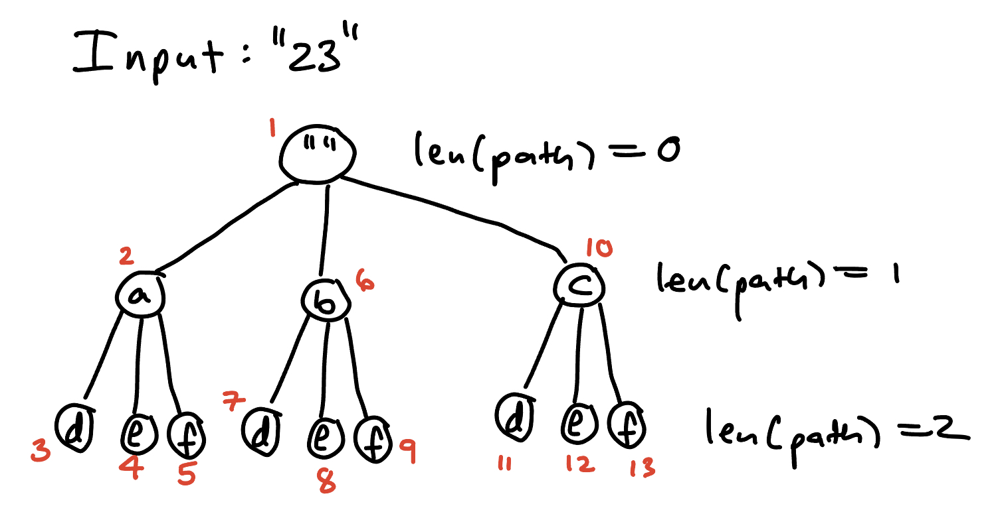

# LC17 - Letter Combinations of a Phone Number

Here we cover two approaches; the first one is easy to understand, but is dependent on the length of digits being between zero and four. The second approach uses backtracking. The second approach is more general in that the length of digits isn't restricted.

## Approach 1 - Concatenation Product Approach

### Solution Description

This solution uses a operation that is done on two sets of strings called the "concatenation product". The [concatenation product](https://en.wikipedia.org/wiki/Concatenation) takes two sets of strings and returns the set of all strings of the form ab where a is a string in the first set and b is a string in the second set. For example, `concatProduct(["app","te"],["le", "er"]) = ["apple", "apper", "tele", "teer"]`. Notice that the solution we must return is the concatenation product of the sets of letters associated with the digits. We implement this concatenation product idea separately for each length of the digits input.

### Code (Java)

```java
import java.util.ArrayList;
import java.util.Arrays;
import java.util.Map;
import static java.util.Map.entry;

class Solution {
    public List<String> letterCombinations(String digits) {
        Map<Character, List<String>> digitsToLetters = Map.ofEntries(
            entry('2', Arrays.asList("a", "b", "c")),
            entry('3', Arrays.asList("d", "e", "f")),
            entry('4', Arrays.asList("g", "h", "i")),
            entry('5', Arrays.asList("j", "k", "l")),
            entry('6', Arrays.asList("m", "n", "o")),
            entry('7', Arrays.asList("p", "q", "r", "s")),
            entry('8', Arrays.asList("t","u","v")),
            entry('9', Arrays.asList("w","x","y", "z"))
        );
        if (digits.length() == 0)
        {
            return new ArrayList<>();
        }
        else if (digits.length() == 1)
        {
            return digitsToLetters.get(digits.charAt(0));
        } 
        else if (digits.length() == 2)
        {
            return concatProduct(digitsToLetters.get(digits.charAt(0)), 
                digitsToLetters.get(digits.charAt(1)));
        } else if (digits.length() == 3)
            return concatProduct(concatProduct(digitsToLetters.get(digits.charAt(0)), 
                digitsToLetters.get(digits.charAt(1))), 
                digitsToLetters.get(digits.charAt(2)));
        else 
        { // digits.length() == 4
            return concatProduct( 

                concatProduct(digitsToLetters.get(digits.charAt(0)), 
                digitsToLetters.get(digits.charAt(1))),

                concatProduct(digitsToLetters.get(digits.charAt(2)), 
                digitsToLetters.get(digits.charAt(3)))
                
               );
        }
    }

    // Returns the combination product of string lists x and y.
    // E.g. concatProduct({"a"}, {"bc", "p"}) = {"abc", "ap"}.
    private List<String> concatProduct(List<String> x, List<String> y)
    {
        List<String> res = new ArrayList<>();
        for (int i = 0; i < x.size(); i++)
        {
            for (int j = 0; j < y.size(); j++)
            {
                res.add(x.get(i) + y.get(j));
            }
        }
        return res;
    }
}
```

### Time and Space Complexity

Asymptotic time and space complexity are not relevant to this solution, since it is only meant to be run with the length of digits being between zero and four. 

## Approach 2 - Backtracking

### Solution Description

We make a mapping from digits to letters. Then we depth first search (dfs) through the tree of permutations of the form [Letter from first digit][Letter from second digit]...[Letter from last digit]. We add each permutation to a list to return. This may seem abstract, so let's think about this more concretely. Here is what the tree of permutations of the specified form looks like for the input digits "23". 



Observe the structure of the tree. At the ith level, each node has a child for each letter that the ith digit maps to. For example, at the first level, we have branches going to each letter that the first digit (2) maps to, i.e. a, b and c. We are solving this problem recursively, so we should consider how a recursive call should be structured. The input of the dfs function should be the path so far, e.g. "a". The base case should run if the length of the path we are on reaches the length of the input digits. At the point of the base case running, we are at a leaf of a path which represents a valid combination. So we add this combination to the list to return. In the recursive case, we use a for-loop that iterates through the letters for the current digit. Note that this loop is what generates children. In each iteration of the loop, we add a letter to the path, recursively call our dfs function and backtrack by removing the added letter from the path.

### Code (Python)

```python
class Solution:
    def letterCombinations(self, digits: str) -> List[str]:
        if len(digits) == 0:
            return []
        
        # letters: number -> list of associated letters
        letters = {
            "2" : ["a", "b", "c"],
            "3" : ["d", "e", "f"],
            "4" : ["g", "h", "i"],
            "5": ["j", "k", "l"],
            "6": ["m", "n", "o"],
            "7": ["p", "q", "r", "s"],
            "8": ["t", "u", "v"],
            "9": ["w", "x", "y", "z"]
        }

        res = []
        
        def dfs(path):
            if len(path) == len(digits):
                res.append(path)
                return 
            cur_digit = digits[len(path)]
            for i in range(0, len(letters[cur_digit])):
                path = path + (letters[cur_digit][i])
                dfs(path)
                path = path[:-1]
        dfs("")
        return res
```

### Time Complexity

A node has three or four children and the recursion tree has $n$ levels, where $n$ is the number of digits in the input. Accordingly, the time complexity is $O(4^n)$.

### Space Complexity

Let $n$ be the number of digits in the input. At any given time, there are at most $n$ active recursive calls, each storing parts of length $n$ permutations. This takes up $O(n^2)$ space. There is also the list to return which stores at most $4^n$ combinations, of size $n$. So the space complexity is $O(n\cdot 4^n)$.