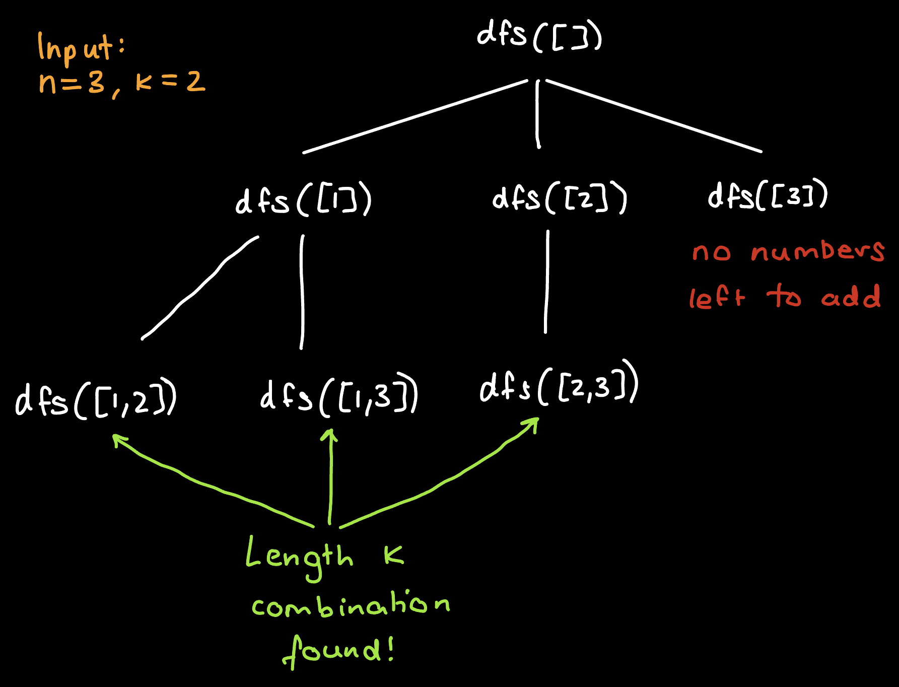

# LC77 - Combinations

Here we discuss a backtracking solution, along with a small but significant optimisation. To ensure it is correct, we prove it's correctness. We also discuss the time and space complexity. 

## Backtracking Solution Description

We use [backtracking](https://en.wikipedia.org/wiki/Backtracking) to solve this problem. More specfically, we do a depth first search on every possible combination of numbers from 1 to n (inclusive), of length k, where we continue down a branch until it may lead to a valid combination. Accordingly, the structure of a recursive call is as follows. **Input**: current path. **Base case**: path length is k. **Recursive case**: Let p be the current path. Recurse on all paths of the form p+i, for all i in $\{\text{p.last+1, p.last} + 2,...,n\}$. To better see how this works, the following visualisation may be helpful.

 

## Code (Python3)

```python
class Solution:
    def combine(self, n: int, k: int) -> List[List[int]]:
        combinations = []
        def dfs(path):
            if len(path) == k:
                combinations.append(path.copy())
                return
            last_num = path[-1] if not len(path) == 0 else 0
            for i in range(last_num+1,n+1):
                path.append(i)
                dfs(path)
                path.pop()
        dfs([])
        return combinations
```

## Correctness Proof

To prove correctness, we will first show that all combinations are generated by the recursion tree. Then we will show that no duplicate combinations are generated. Together, if these propositions are true, then the algorithm must be correct.

The recursion tree starts off by exhaustively generating all possible combinations. At any given branch, this continues until the branch can no longer represent a valid combination. That is, until the length of the branch goes past k. So all the desired combinations are indeed generated.

Now we will argue that no duplicate combination is generated. Let A and B be branches of the recursion tree. By the structure of a tree, they must diverge at some node. At this node, a decision is made for branch A to include a number a, and for branch B to include the number b, where the numbers aren't equal. Without loss of generality, we assume a < b. The branches are in increasing order which means further decisions on branch B cannot involve the inclusion of a. So branch A contains a number which branch B doesn't. Hence branches A and B represent different combinations.

We have shown the propositions are true, so the algorithm is correct.

## Optimisation - Pruning Earlier

Our algorithm could prune branches earlier. In particular, we require combinations to be of length k. Suppose the algorithm is running and the last number added to a branch is x. Notice that if the distance between x and n is less than the required additional nodes to make the branch length k, then we can prune the branch. We implement this by ensuring nodes do not generate children, where the child would represent a number x being included in a combination. So if the following is ensured, the end up pruning some branches earlier. 

$n - x >= k - \text{length of current path}$

Rearranging this inequality, we get the following.

$x <= \text{length of current path} + n - k$

This is equivalent to:

$x < \text{length of current path} + n - k + 1$

We modify the loop which generates children, to ensure this constraint is satisfied, thereby resulting in earlier pruning.

### Optimised Code (Python3)

```python
class Solution:
    def combine(self, n: int, k: int) -> List[List[int]]:
        combinations = []
        def dfs(path):
            if len(path) == k:
                combinations.append(path.copy())
                return
            last_num = path[-1] if not len(path) == 0 else 0
            for i in range(last_num+1,min(n+1, n + len(path) - k + 2)):
                path.append(i)
                dfs(path)
                path.pop()
        dfs([])
        return combinations
```

## Time and Space

There are at most $\binom{n}{k}$ ("n choose k") nodes, accordingly there are at most $\binom{n}{k}$ recursive calls. The run time on each call is constant. So the run time is $O(\binom{n}{k})$. Each call stores a path of at most length $k$. So the space complexity is $O(k \cdot \binom{n}{k})$.